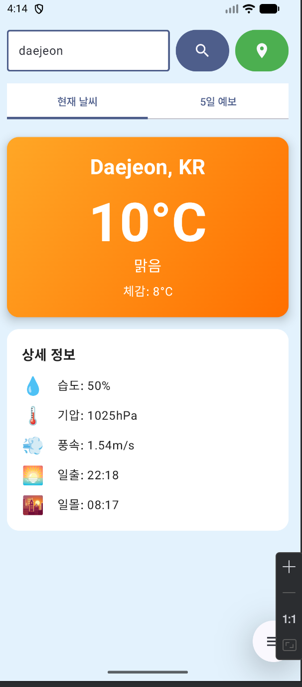
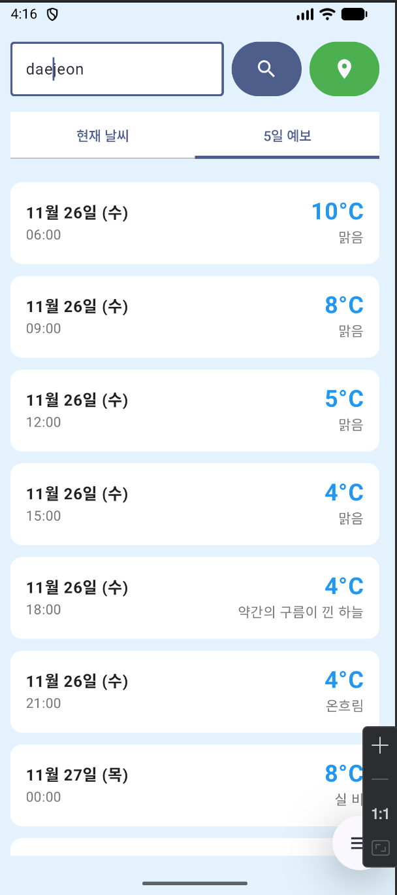

# 🌤️ Weather App

<div align="center">


**실시간 날씨 정보와 5일 예보를 제공하는 Android 날씨 앱**

[Features](#-주요-기능) • [Screenshots](#-스크린샷) • [Installation](#-설치-방법) • [Usage](#-사용-방법) • [Tech Stack](#-기술-스택)

</div>

---

## ✨ 주요 기능

### 🔍 도시 검색
- 전 세계 모든 도시의 날씨 정보 검색
- 실시간 온도, 습도, 기압, 풍속 확인

### 📍 위치 기반 날씨
- GPS를 활용한 현재 위치 자동 감지
- 한 번의 클릭으로 내 위치의 날씨 확인

### 📅 5일 예보
- 3시간 간격으로 제공되는 상세한 날씨 예보
- 최대 40개의 예보 데이터 확인

### 🎨 날씨별 테마
- 맑음, 흐림, 비, 눈 등 날씨에 따른 그라데이션 배경
- 직관적이고 아름다운 UI/UX

---

## 📱 스크린샷

<div align="center">

| 현재 날씨 | 5일 예보 | 위치 검색 |
|:---:|:---:|:---:|
|  |  |  |

</div>

---

## 🚀 설치 방법

### 1️⃣ 프로젝트 클론

```bash
git clone https://github.com/yourusername/weather-app.git
cd weather-app
```

### 2️⃣ OpenWeatherMap API 키 발급

1. [OpenWeatherMap](https://openweathermap.org/) 접속
2. 무료 계정 생성
3. API Keys 메뉴에서 API 키 발급

### 3️⃣ API 키 설정

`MainActivity.kt` 파일에서 API 키 입력:

```kotlin
val API_KEY = "YOUR_API_KEY_HERE" // 여기에 발급받은 API 키 입력
```

### 4️⃣ 빌드 및 실행

1. Android Studio에서 프로젝트 열기
2. **Sync Project with Gradle Files** 클릭
3. 에뮬레이터 또는 실제 기기에서 실행

---

## 🎮 사용 방법

### 도시로 날씨 검색
1. 상단 텍스트 필드에 도시 이름 입력
2. 🔍 검색 버튼 클릭
3. 현재 날씨 정보 확인

### 현재 위치 날씨 확인
1. 📍 위치 버튼(초록색) 클릭
2. 위치 권한 허용
3. 자동으로 현재 위치의 날씨 표시

### 5일 예보 확인
1. 상단 탭에서 **"5일 예보"** 선택
2. 시간대별 상세 날씨 정보 확인

---

## 🛠️ 기술 스택

### Language
- **Kotlin** - 100% Kotlin으로 작성

### UI Framework
- **Jetpack Compose** - 선언형 UI 프레임워크
- **Material Design 3** - 최신 디자인 시스템

### Architecture & Libraries
- **Coroutines** - 비동기 프로그래밍
- **Google Play Services Location** - 위치 기반 서비스
- **OpenWeatherMap API** - 날씨 데이터 제공

### Development Tools
- **Android Studio** - IDE
- **Gradle** - 빌드 시스템

---

## 📋 요구 사항

- **Android SDK**: 24+
- **Target SDK**: 35
- **Kotlin**: 1.9+
- **Gradle**: 8.0+

---

## 🔑 권한

앱이 사용하는 권한:

```xml
<uses-permission android:name="android.permission.INTERNET" />
<uses-permission android:name="android.permission.ACCESS_NETWORK_STATE" />
<uses-permission android:name="android.permission.ACCESS_FINE_LOCATION" />
<uses-permission android:name="android.permission.ACCESS_COARSE_LOCATION" />
```

---

## 📦 프로젝트 구조

```
weather-app/
├── app/
│   ├── src/
│   │   └── main/
│   │       ├── java/com/example/weather/
│   │       │   ├── MainActivity.kt          # 메인 액티비티
│   │       │   └── ui/theme/                # 테마 설정
│   │       ├── AndroidManifest.xml          # 앱 설정 및 권한
│   │       └── res/                         # 리소스 파일
│   └── build.gradle.kts                     # 앱 레벨 Gradle 설정
├── gradle/
└── build.gradle.kts                         # 프로젝트 레벨 Gradle 설정
```

---

## 🎯 주요 코드 구조

### 날씨 데이터 모델
```kotlin
data class WeatherData(
    val temp: Double,
    val feelsLike: Double,
    val humidity: Int,
    val pressure: Int,
    val description: String,
    val icon: String,
    val windSpeed: Double,
    val cityName: String,
    val country: String,
    val sunrise: String,
    val sunset: String
)
```

### 예보 데이터 모델
```kotlin
data class ForecastItem(
    val date: String,
    val time: String,
    val temp: Double,
    val description: String,
    val icon: String
)
```

---

## 🌟 특징

- ✅ **100% Kotlin** - 타입 안전성과 간결한 코드
- ✅ **Jetpack Compose** - 선언형 UI로 빠른 개발
- ✅ **Material Design 3** - 현대적이고 세련된 디자인
- ✅ **실시간 데이터** - OpenWeatherMap API 활용
- ✅ **위치 기반** - GPS로 정확한 현재 위치 날씨
- ✅ **반응형 UI** - 다양한 화면 크기 지원

---

## 🐛 알려진 이슈

현재 알려진 이슈가 없습니다. 문제를 발견하시면 [Issues](https://github.com/yourusername/weather-app/issues)에 등록해주세요.

---

## 🤝 기여하기

기여를 환영합니다! 다음 단계를 따라주세요:

1. Fork the Project
2. Create your Feature Branch (`git checkout -b feature/AmazingFeature`)
3. Commit your Changes (`git commit -m 'Add some AmazingFeature'`)
4. Push to the Branch (`git push origin feature/AmazingFeature`)
5. Open a Pull Request

---

## 📝 라이선스

이 프로젝트는 MIT 라이선스를 따릅니다. 자세한 내용은 [LICENSE](LICENSE) 파일을 참조하세요.

---

## 👨‍💻 개발자

**kosmos-s**
- GitHub: [@yourusername](https://github.com/kosmos-s)

---

## 🙏 감사의 말

- [OpenWeatherMap](https://openweathermap.org/) - 날씨 데이터 제공
- [Material Design](https://m3.material.io/) - 디자인 가이드라인
- [Jetpack Compose](https://developer.android.com/jetpack/compose) - UI 프레임워크

---

<div align="center">

**⭐ 이 프로젝트가 도움이 되었다면 Star를 눌러주세요! ⭐**

Made with ❤️ and ☕

</div>
